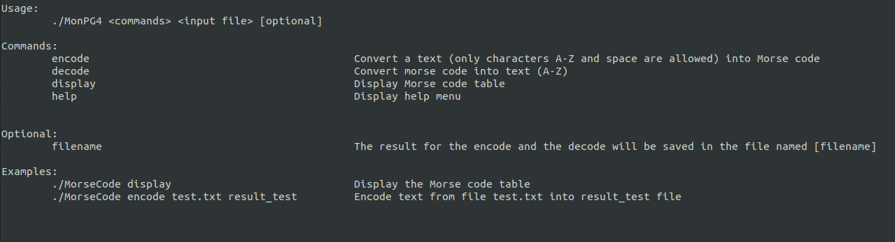
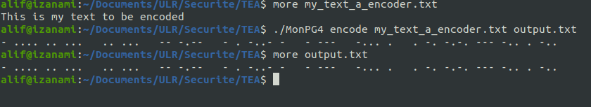
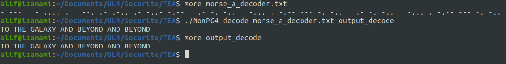
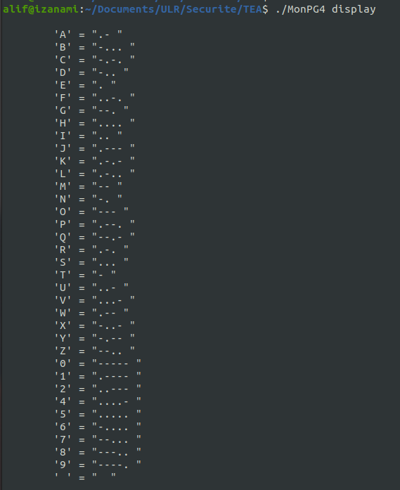
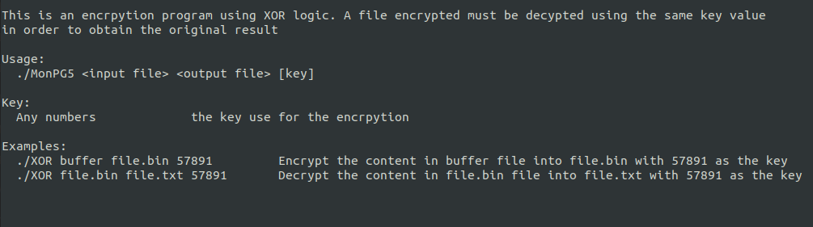
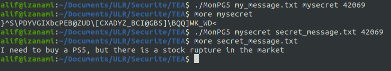
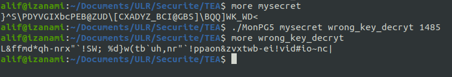
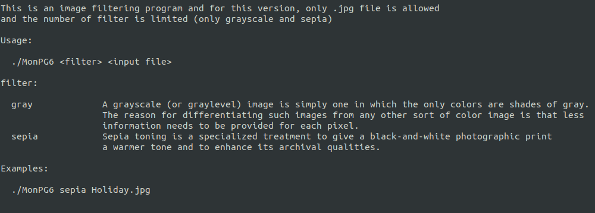

# Utilities program for Security Project

This is a part of the project developed by me for a group project with my partner.

This 3 programs are served only as the additional features for the whole project.

The programs: 

1.  **MonPG4** : Morse Code translation, this program allows users to encode a message as Morse code and also to decode Morse code.

   

   

   

   

   

2. **MonPG5**: XOR Encryption, This program allows users to encrypt a message, a text or even a password with a key (positive integer> 0). The message cannot be decrypted without knowing the key value used during its encryption, but since this is a basic program, there will be a possibility to find the key value to use (eg: brute force algorithm)

   

   > Encryption using the same key value

   

   > Encryption using different key value

   

3. **MonPG6**: Image Filter,  This program allows users to filter a .jpg image in black-white (grayscale) and sepia (sepia) format. There are also other filters, but they are not implemented in this program.  To carry out this program, I use 3 libraries created by  [Mr. Sean BARRETT ](https://github.com/nothings/stb) for the manipulation of images. I use them in order to load a .jpg file to a pixel array where it will do the modification of its RGB values and then convert it and save as new image. 

   

   > Original photo

   

   > Gray scale filter

   

   

   > Sepia filter

   

